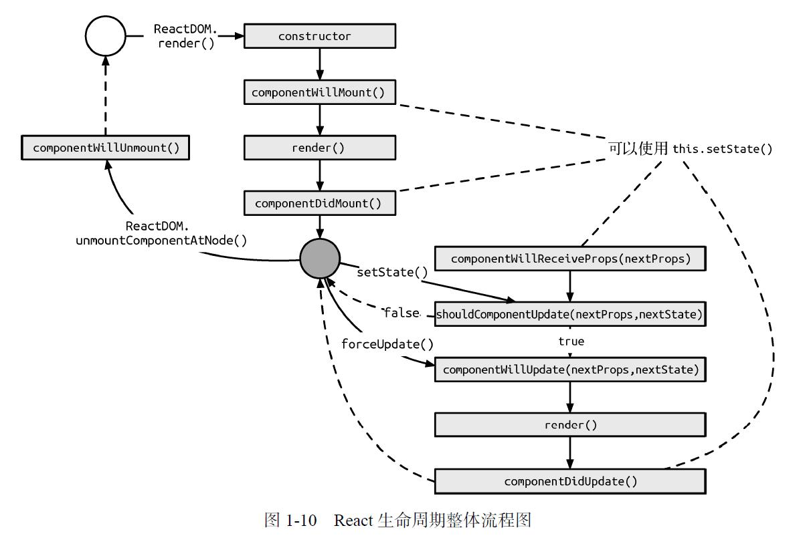
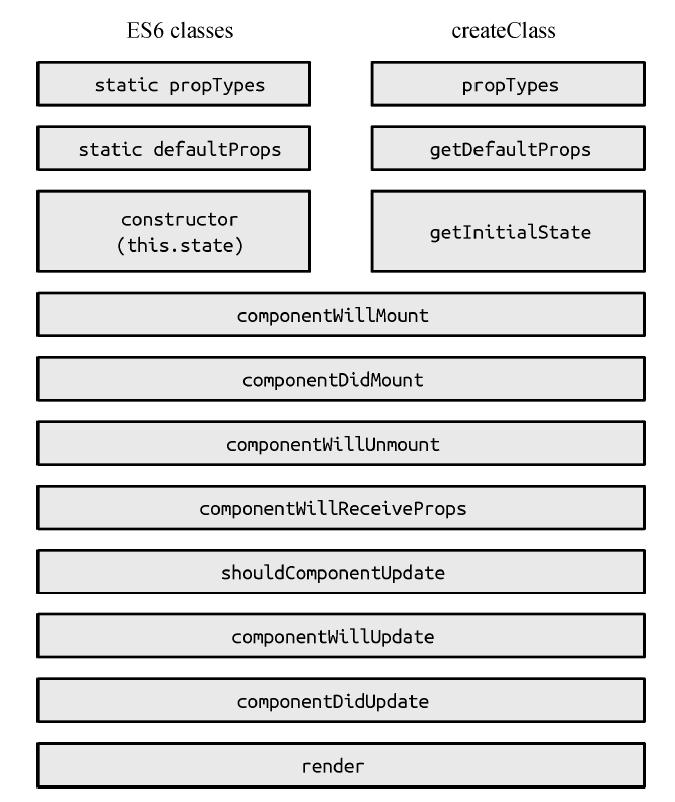

### `React`生命周期

#### 挂载或卸载过程

1、组件的挂载

组件的挂载是最基本的过程，这个过程主要是组件状态的初始化

``` jsx
import React,{Compoennt,PropTypes} from 'react';

class App extends Component{
    static propTypes = {
        //...
    }

    static defaultProps={
        //...
    }

    constructor(props){
        super(props);
        this.state={
            //...
        };
    }

    componentWillMount(){
        //在此处调用setState方法，组件只渲染一次，这和初始化时候设置this.state一样，所以这是无意义的
        //... 
    }

    render(){
        return <div>This is my App</div>
    }

    componentDidMount(){
        //在此处调用setState方法，组件会渲染两次，虽然这样不太好，但是有些场景是必须这么做的
        //...
    }
}
```

2、组件的卸载

组件卸载非常简单，只有`componentWillUnmount`这一个卸载前状态

``` jsx
import React , {Component} from 'react';

class App extends Component{
    componentWillUnmount(){
        //经常会执行一些清理方法，如事件回收或者清楚定时器等
        //...
    }
    render(){
        return <div>This is my App</div>
    }
}
```

#### 数据更新过程

以下两种情况会触发组件的更新
1、父组件向下传递`props`
2、组件自身执行`setState`方法

``` jsx
import React,{Component} from 'react';

class App extends Component{
    componentWillReceiveProps(nextProps){
        //this.setState()
    }

    shouldComponentUpdate(nextProps,nextState){
        //return true
    }

    componentWillUpdate(nextProps,nextState){
        //...
    }

    componentDidUpdate(prevProps,prevState){
        //...
    }

    render(){
        return <div>This is my app</div>
    }
}
```

如果组件自身的`state`更新了，那么会依次执行`shouldComponentUpdate`、`componentWillUpdate`、`render`、`componentDidUpdate`

`shouldComponentUpdate`方法返回`false`时，组件不再向下执行生命周期方法。默认返回`true`。

如果组件由父组件更新`props`而更新，那么会先执行`componentWillReceiveProps`方法，此方法中可以调用`setState`方法，同时组件不会二次渲染。

#### 生命周期整体流程



`createClass` 和 `es6`的`classes`构建组件，生命周期稍有不同




