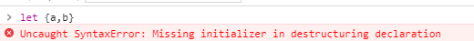

# es6之变量的解构赋值

### 为什么需要解构赋值？

``` js

    //es5

    var options = {
        repeat: true,
        save: false
    };

    var repeat = options.repeat,
        save = options.repeat;

    //es6
    let options = {
        repeat: true,
        save: false
    };

    let {repeat,save} = options;


```

如果变量很多的话就更能体现出来很方便了

### 使用解构方式定义变量的时候必须初始化

``` js
    var {a,b};
    let {a,b};
    const {a,b}

    //以上三种方式都会报这个错误 Uncaught SyntaxError: Missing initializer in destructuring declaration
```


### 


